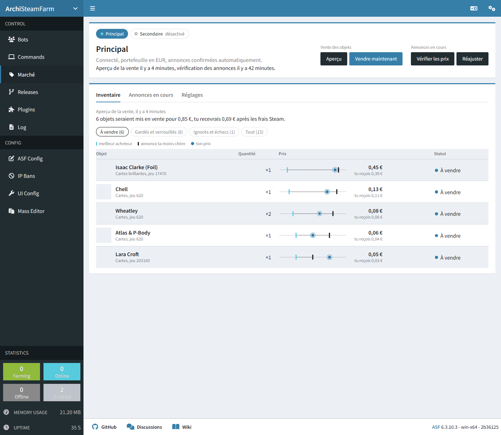

# MarketSeller

Plugin pour [ArchiSteamFarm](https://github.com/JustArchiNET/ArchiSteamFarm) qui met en vente automatiquement les objets de l'inventaire Steam (cartes à collectionner par défaut) sur le marché de la communauté. Il suit l'évolution des prix et laisse de côté les objets que tu as verrouillés.

Il ajoute une page **Marché** au tableau de bord d'ASF :



## Installation

1. Télécharge `MarketSeller.zip` depuis la [dernière version](https://github.com/fraustiz/ASF-MarketSeller/releases/latest).
2. Décompresse-le dans `<dossier d'ASF>/plugins/MarketSeller/`. Il contient un seul fichier, `ArchiSteamFarm.CustomPlugins.MarketSeller.dll`, la page web est intégrée dedans.
3. Redémarre ASF. Le log affiche `MarketSeller vX.Y.Z chargé`.
4. Ouvre l'interface web d'ASF : l'entrée **Marché** apparaît dans la barre latérale, sous « Commands ». Tout se règle depuis l'onglet **Réglages** de cette page.

**Docker** : le dossier `plugins` doit être monté (par exemple `- <dossier>/plugins:/app/plugins`) et modifiable par le conteneur, pour que les mises à jour puissent s'installer. Le plugin fonctionne avec l'image `latest`, qui est une version allégée d'ASF (voir [Développement](#développement)).

## Mises à jour

Quand une nouvelle version est publiée ici, la page Marché affiche « MarketSeller X.Y.Z est disponible », avec un bouton **Mettre à jour**. Il fait installer la nouvelle version par ASF :

1. ASF télécharge le zip de la release ;
2. il remplace le DLL, en gardant une sauvegarde de l'ancien ;
3. il redémarre, ce qui déconnecte les bots quelques secondes ;
4. la page se recharge toute seule une fois ASF revenu.

Autres possibilités :
- la commande `updateplugins stable ArchiSteamFarm.CustomPlugins.MarketSeller`, dans la console ou le chat Steam d'un bot ;
- ajouter `"ArchiSteamFarm.CustomPlugins.MarketSeller"` à `PluginsUpdateList` dans `ASF.json`, pour qu'ASF le mette à jour en même temps que ses propres vérifications.

La page vérifie les nouvelles versions au plus une fois toutes les 30 minutes, avec un bouton « Vérifier maintenant ».

## Prérequis côté Steam

- Le compte doit avoir accès au marché : au moins 5 $ dépensés, Steam Guard actif depuis 15 jours, pas de restriction en cours.
- **Authentificateur mobile importé dans ASF** (fichier `.maFile` dans le dossier `config`) : il valide les mises en vente automatiquement. Sans lui, il faut confirmer chaque annonce dans l'application Steam, et le réajustement des prix est désactivé.
- Commence en simulation (case « Mode simulation » ou commande `mpreview`) pour vérifier les prix avant de vendre pour de vrai.

## La page Marché

- **En haut** : le choix du bot, son état et les boutons.
  - « Aperçu » et « Vérifier les prix » ne modifient rien.
  - « Vendre maintenant » et « Réajuster » demandent un second clic pour confirmer.
  - Pendant une opération, une barre montre où elle en est (objet en cours, nombre traité sur le total).
- **Inventaire** : le résultat du dernier aperçu ou de la dernière vente. Pour chaque objet : le prix de mise en vente, ce que tu reçois, et une échelle qui situe ton prix entre le meilleur acheteur et l'annonce la moins chère. Les filtres séparent ce qui est vendu, ce qui est gardé ou verrouillé (avec la raison), et ce qui a été ignoré.
- **Annonces en cours** : le résultat de la dernière vérification ou du dernier réajustement, avec l'ancien et le nouveau prix de chaque annonce.
- **Réglages** : toutes les options dans un formulaire, avec un exemple de prix calculé en direct. « Enregistrer » écrit dans le fichier de config du bot, qui se reconnecte quelques secondes à Steam pour appliquer les réglages, comme quand on enregistre une config depuis ASF.

La page utilise le thème, le mode sombre et le mot de passe IPC de l'interface d'ASF. Son API (`/Api/MarketSeller`) est protégée par ce même mot de passe.

ASF-ui ne prévoit pas d'extension par les plugins. Au démarrage du serveur web d'ASF, le plugin prend donc le `index.html` d'ASF-ui et y ajoute un script, qui crée l'entrée « Marché » et la page. Ce fichier est refait à chaque démarrage à partir de la version d'ASF installée, ce qui suit les mises à jour d'ASF. Si l'interface d'ASF est absente, la page reste accessible seule sur `/market-seller/index.html`.

## Configuration

Les réglages se font depuis la page, qui les écrit dans la section `MarketSeller` du fichier de config du bot (`config/<NomDuBot>.json`). Tu peux aussi l'écrire à la main.

Dans le fichier, tous les prix sont en **centimes de la devise du portefeuille** et correspondent au **prix payé par l'acheteur**, comme affiché sur le marché. Le plugin calcule tout seul ce que tu reçois après les frais Steam (environ 15 %, minimum 0,03 payé par l'acheteur).

Exemple complet, avec les valeurs par défaut sauf `Enabled` :

```json
{
  "MarketSeller": {
    "Enabled": true,
    "DryRun": false,
    "Types": ["TradingCard"],
    "KeepPerItem": 0,
    "SellOnFarmingFinished": true,
    "SellIntervalMinutes": 360,
    "RepriceIntervalMinutes": 120,
    "RepriceThresholdCents": 1,
    "AutoConfirm": true,
    "Country": "FR",
    "RequestDelayMilliseconds": 3000,
    "Pricing": {
      "Source": "LowestSellOrder",
      "Multiplier": 1.0,
      "OffsetCents": 0,
      "MinCents": 3,
      "MaxCents": 0,
      "FixedCents": 0,
      "AverageDays": 7
    },
    "Lock": {
      "Rarities": [],
      "AppIDs": [],
      "Names": [],
      "PriceAboveCents": 0,
      "PriceBelowCents": 0
    }
  }
}
```

### Options générales

| Option | Rôle |
|---|---|
| `Enabled` | Active le plugin pour ce bot. Sans section ou avec `false`, rien ne se passe. |
| `DryRun` | Simulation : calcule et affiche les prix sans rien mettre en vente ni retirer. |
| `Types` | Catégories d'objets à vendre. Tout ce qui n'est pas listé n'est jamais vendu. Valeurs : `TradingCard`, `FoilTradingCard`, `Emoticon`, `ProfileBackground`, `BoosterPack`, `SteamGems`, `SaleItem`, `Sticker`, `ChatEffect`, `MiniProfileBackground`, `AvatarProfileFrame`, `AnimatedAvatar`, `KeyboardSkin`, `StartupVideo`, `ProfileModifier`, `Consumable`. |
| `KeepPerItem` | Nombre d'exemplaires de chaque objet à garder (ex : `1` pour garder une carte de chaque, utile pour les badges). |
| `SellOnFarmingFinished` | Lance une vente quand ASF a fini de farmer des cartes. |
| `SellIntervalMinutes` | Vente périodique (`0` = désactivée). La première a lieu 5 min après le démarrage. |
| `RepriceIntervalMinutes` | Réajustement périodique des annonces en cours (`0` = désactivé). |
| `RepriceThresholdCents` | Écart minimum entre le prix actuel et le prix cible pour retirer puis remettre une annonce. |
| `AutoConfirm` | Valide les annonces via l'authentificateur ASF. |
| `Country` | Code pays envoyé à Steam pour lire le carnet d'ordres. |
| `RequestDelayMilliseconds` | Pause entre deux requêtes au marché, partagée par tous les bots. Steam bloque vite les requêtes trop rapprochées. |

### Prix (`Pricing`)

| Option | Rôle |
|---|---|
| `Source` | D'où vient le prix de base (voir ci-dessous). |
| `Multiplier` | Multiplie le prix de base (ex : `0.95` = 5 % moins cher). |
| `OffsetCents` | Ajouté après le multiplicateur (ex : `-1` = 1 centime moins cher). |
| `MinCents` | Ne jamais mettre en vente en dessous de ce prix : le prix est relevé à ce minimum. |
| `MaxCents` | Ne jamais dépasser ce prix (`0` = pas de plafond). |
| `FixedCents` | Prix utilisé avec la source `Fixed`. |
| `AverageDays` | Nombre de jours pris en compte par `AverageSold`. |

Sources :

- `HighestBuyOrder` : prix de l'ordre d'achat le plus haut. L'objet est vendu **immédiatement** à cet acheteur.
- `LowestSellOrder` : prix de l'annonce la moins chère des autres vendeurs, c'est le prix « À partir de » affiché par Steam, et le plus haut auquel ton objet part en premier. Tes propres annonces sont exclues du calcul, donc le plugin ne baisse jamais son prix pour se battre contre lui-même.
- `AverageSold` : moyenne des ventes réelles des `AverageDays` derniers jours, pondérée par le volume.
- `Fixed` : `FixedCents` pour tout.

### Verrouillage (`Lock`)

Un objet verrouillé n'est jamais mis en vente.

| Option | Verrouille |
|---|---|
| `Rarities` | Ces raretés (`Common`, `Uncommon`, `Rare`). Les fonds d'écran et émoticônes rares sont `Rare`. |
| `AppIDs` | Les objets de ces jeux (AppID Steam, ex : `440` pour TF2). |
| `Names` | Les objets dont le nom contient l'un de ces textes (sans tenir compte des majuscules). |
| `PriceAboveCents` | Les objets dont le prix calculé est supérieur ou égal à cette valeur, pour garder ce qui vaut cher. |
| `PriceBelowCents` | Les objets dont le prix calculé est inférieur à cette valeur, pour ne pas brader ce qui ne vaut rien. |

Les verrous de prix comparent le prix calculé (source + multiplicateur + décalage), avant `MinCents` et `MaxCents`. Ils sont revérifiés à chaque réajustement : une annonce dont le prix passe au-dessus de `PriceAboveCents`, ou en dessous de `PriceBelowCents`, est retirée de la vente et l'objet revient dans l'inventaire.

### Exemples

Vendre tout de suite au meilleur acheteur, sauf ce qui vaut plus de 0,50 :
```json
"MarketSeller": { "Enabled": true, "Pricing": { "Source": "HighestBuyOrder" }, "Lock": { "PriceAboveCents": 50 } }
```

Toujours être le moins cher d'un centime, jamais sous 0,05, avec réajustement toutes les heures :
```json
"MarketSeller": { "Enabled": true, "RepriceIntervalMinutes": 60, "Pricing": { "Source": "LowestSellOrder", "OffsetCents": -1, "MinCents": 5 } }
```

Vendre à 90 % de la moyenne des 3 derniers jours, cartes et cartes brillantes, en gardant un exemplaire de chaque :
```json
"MarketSeller": { "Enabled": true, "Types": ["TradingCard", "FoilTradingCard"], "KeepPerItem": 1, "Pricing": { "Source": "AverageSold", "AverageDays": 3, "Multiplier": 0.9 } }
```

Prix fixe de 0,10 pour les cartes et émoticônes, sans toucher aux objets rares ni à un jeu précis :
```json
"MarketSeller": { "Enabled": true, "Types": ["TradingCard", "Emoticon"], "Pricing": { "Source": "Fixed", "FixedCents": 10 }, "Lock": { "Rarities": ["Rare"], "AppIDs": [570] } }
```

## Commandes

Les commandes font la même chose que les boutons de la page. À envoyer dans le chat Steam du bot, dans la page « Commands » de l'interface web d'ASF ou dans la console. Accès `Master` requis. Ajoute des noms de bots pour viser d'autres bots (ex : `msell bot1,bot2` ou `msell ASF` pour tous).

| Commande | Effet |
|---|---|
| `mpreview` | Simulation : liste ce qui serait vendu et à quel prix. |
| `msell` | Lance une vente maintenant. |
| `mrepricepreview` | Simulation du réajustement des annonces en cours. |
| `mreprice` | Réajuste les annonces maintenant. |
| `mstatus` | Rappel de la config, opération en cours et résultat des dernières opérations. |

## Fonctionnement et limites

- **Identifiants des objets** : pour lire le carnet d'ordres d'un objet, il faut son identifiant sur le marché. Le plugin le trouve dans la page de l'objet, puis le garde en mémoire pour toujours (dans `config/ASF.db`). Steam surveille beaucoup cette page : au premier aperçu, avec beaucoup d'objets différents, il peut limiter les requêtes. Le plugin s'arrête alors et reprend au lancement suivant, sans redemander les identifiants déjà connus.
- **Réajustement** : Steam ne permet pas de modifier le prix d'une annonce, donc le plugin la retire, puis remet l'objet en vente au nouveau prix. Chaque remise en vente demande une nouvelle confirmation, faite par l'authentificateur ASF.
- **Annonces gérées** : seules les annonces d'objets que le plugin a déjà vus dans l'inventaire, et qui passent les filtres `Types` et `Lock`, sont réajustées. Les annonces créées à la main avant l'installation ne sont pas touchées.
- **Limite de requêtes** : si Steam répond « trop de requêtes » (HTTP 429), le plugin arrête et attend 15 minutes avant de refaire des requêtes au marché. Augmente `RequestDelayMilliseconds` si ça arrive souvent.
- **Confirmations** : le plugin valide toutes les annonces du marché en attente sur le compte, y compris celles que tu aurais créées à la main au même moment.

## Développement

Il faut le SDK .NET 10. Le premier build télécharge `ArchiSteamFarm.dll` depuis la release officielle d'ASF indiquée par `ASFVersion` dans `Directory.Build.props`. Ce DLL ne sert qu'à la compilation : à l'exécution, c'est celui d'ASF qui est utilisé.

```
dotnet test ArchiSteamFarm.CustomPlugins.MarketSeller.Tests
dotnet publish ArchiSteamFarm.CustomPlugins.MarketSeller -c Release -o out
```

### Compatibilité avec la version allégée d'ASF

L'image Docker `latest` d'ASF est une version allégée (« trimmed ») : les méthodes .NET qu'ASF n'utilise pas lui-même en sont retirées, et un plugin qui en appelle une plante à l'exécution. La conversion JSON automatique de .NET y est aussi désactivée. Le plugin n'utilise donc que des méthodes présentes dans cette version, et indique explicitement à .NET comment convertir le JSON.

À chaque build, GitHub Actions compile un ASF allégé, puis vérifie avec `tools/TrimCheck` que chaque type et méthode utilisés par le plugin y existent. Pour le faire à la main (il faut un SDK .NET 10 assez récent pour compiler ASF, 10.0.4xx ou plus) :

```
git clone --depth 1 --branch <ASFVersion> https://github.com/JustArchiNET/ArchiSteamFarm.git asf-src
dotnet publish asf-src/ArchiSteamFarm -c Release -o asf-trimmed -r linux-x64 --self-contained -p:PublishTrimmed=true
dotnet run --project tools/TrimCheck -- out/ArchiSteamFarm.CustomPlugins.MarketSeller.dll asf-trimmed
```

### Publier une version

1. Change `Version` dans `Directory.Build.props`.
2. Crée et pousse un tag avec le même numéro, **sans « v » devant**, car ASF lit le nom du tag comme numéro de version :
   ```
   git tag 1.2.1
   git push origin 1.2.1
   ```

GitHub Actions compile, teste, vérifie la compatibilité, puis crée la release avec `MarketSeller.zip`. Les installations existantes proposent alors la mise à jour.

## Licence

Copyright 2026 fraustiz, sous [licence Apache 2.0](LICENSE) : tu peux utiliser, modifier et redistribuer ce code, y compris dans un projet commercial, à condition de garder la licence et la mention de copyright (fichier [NOTICE](NOTICE)). C'est la même licence qu'ArchiSteamFarm.
